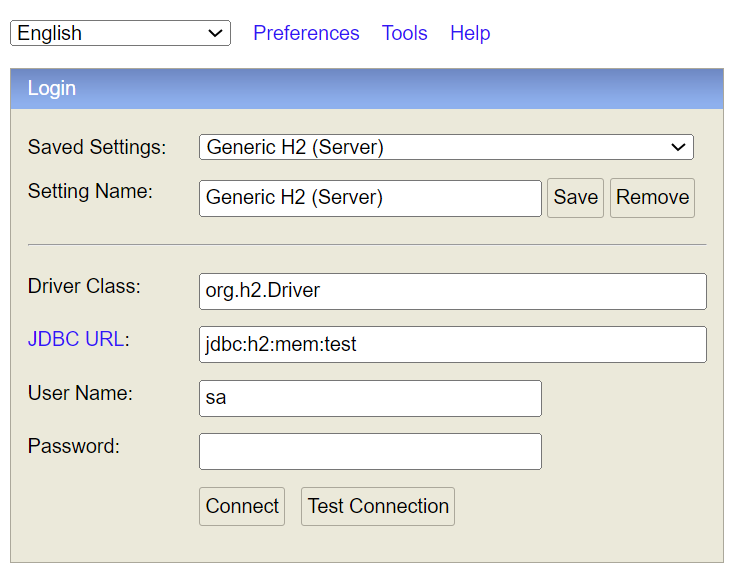

# data
Ilustra uso de JPA com auxílio do Spring Framework

## Informações
O arquivo 'application.properties' é transcrito abaixo.

```
logging.level.root = INFO

spring.jpa.hibernate.ddl-auto=create-drop
spring.jpa.show-sql=true

# set connection url to H2 in memory
spring.datasource.url=jdbc:h2:mem:test

spring.h2.console.enabled=true
spring.h2.console.path=/h2
```

A primeira linha indica que é para ser criado o esquema, após "drop" das tabelas 
em questão, ou seja, é opção exclusiva para testes.

A segunda linha indica o uso do SGBD H2 (in-memory), ou seja, estará disponível
via console, configurado nas duas linhas seguintes, apenas enquanto a aplicação
estiver em execução.

## Passos
- ```mvn spring-boot:run``` coloca a aplicação em execução
- ```curl http://localhost:8080/create``` para criar uma entrada na tabela
USUARIOS (chave é um valor gerado aleatoriamente).
- ```http://localhost:8080/h2``` oferece acesso ao H2 enquanto o aplicativo estiver em execução. 
A URL para acesso ao banco
usado pela aplicação deve ser a mesma daquela contida em 'application.properties'. A tela abaixo ilustra o console com a configuração esperada para conexão com o H2.



